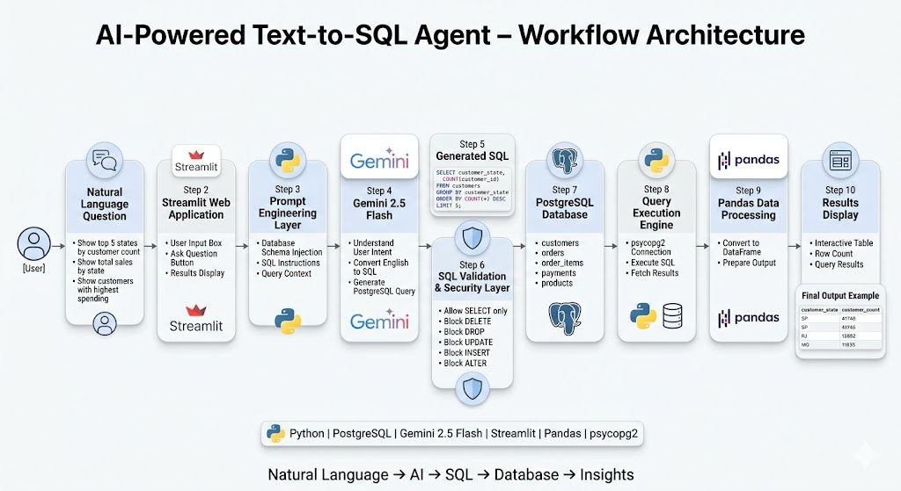

# 🤖 AI Text-to-SQL Agent

## Overview

AI Text-to-SQL Agent is an AI-powered analytics application that converts natural language questions into PostgreSQL queries, executes them against a database, and returns results in an interactive web interface.



The project demonstrates how Large Language Models (LLMs) can be integrated with relational databases to enable non-technical users to retrieve information using plain English instead of SQL.

Example:

**User Question**

> Show top 5 states by customer count

**Generated SQL**

```sql
SELECT
    customer_state,
    COUNT(customer_id) AS customer_count
FROM customers
GROUP BY customer_state
ORDER BY customer_count DESC
LIMIT 5;
```

**Result**

| customer_state | customer_count |
| -------------- | -------------- |
| SP             | 41746          |
| RJ             | 12852          |
| MG             | 11635          |
| RS             | 5466           |
| PR             | 5045           |

---

# Features

* Natural Language to SQL conversion using Gemini
* PostgreSQL database integration
* Streamlit web interface
* SQL validation and security controls
* Dynamic query execution
* Real-time result display
* AI-generated SQL visualization
* Support for business analytics questions

---

# Tech Stack

| Component              | Technology                 |
| ---------------------- | -------------------------- |
| Programming Language   | Python                     |
| Database               | PostgreSQL                 |
| LLM                    | Gemini 2.5 Flash           |
| Framework              | Streamlit                  |
| Database Connector     | psycopg2                   |
| Data Processing        | Pandas                     |
| Environment Management | Python Virtual Environment |

---

# Project Architecture

```text
User Question
      │
      ▼
Streamlit UI
      │
      ▼
Gemini API
      │
      ▼
SQL Generation
      │
      ▼
SQL Validator
      │
      ▼
PostgreSQL Database
      │
      ▼
Query Results
      │
      ▼
Streamlit Data Table
```

---

# Project Structure

```text
AI-Text-to-SQL/
│
├── app.py
│
├── ai/
│   ├── __init__.py
│   ├── sql_generator.py
│
├── database/
│   ├── __init__.py
│   ├── db_connection.py
│   ├── query_executor.py
│
├── prompts/
│   └── sql_prompt.txt
│
├── utils/
│   ├── __init__.py
│   └── sql_validator.py
│
├── dataset/
│   ├── olist_customers_dataset.csv
│   ├── olist_orders_dataset.csv
│   ├── olist_order_items_dataset.csv
│   ├── olist_order_payments_dataset.csv
│   └── olist_products_dataset.csv
│
├── .env
├── requirements.txt
└── README.md
```

---

# Database Schema

### Customers

```text
customer_id
customer_unique_id
customer_city
customer_state
```

### Orders

```text
order_id
customer_id
order_status
order_purchase_timestamp
```

### Order Items

```text
order_id
product_id
seller_id
price
freight_value
```

### Payments

```text
order_id
payment_type
payment_value
```

### Products

```text
product_id
product_category_name
```

---

# Security Controls

To prevent harmful database operations, the application blocks:

* DELETE
* DROP
* UPDATE
* INSERT
* ALTER
* TRUNCATE

Only SELECT queries are allowed.

Example:

```text
Delete all customers
```

Result:

```text
Forbidden SQL operation detected: DELETE
```

---

# Installation

## Clone Repository

```bash
git clone <repository-url>
cd AI-Text-to-SQL
```

---

## Create Virtual Environment

```bash
python -m venv venv
```

Activate:

### Windows

```bash
venv\Scripts\activate
```

### Linux / Mac

```bash
source venv/bin/activate
```

---

## Install Dependencies

```bash
pip install -r requirements.txt
```

---

# Configure Environment Variables

Create a `.env` file:

```env
DB_HOST=localhost
DB_NAME=text_to_sql
DB_USER=postgres
DB_PASSWORD=your_password

GOOGLE_API_KEY=your_gemini_api_key
```

---

# Run Application

```bash
streamlit run app.py
```

Application opens in:

```text
http://localhost:8501
```

---

# Example Questions

### Basic Queries

```text
Show all customers

Show total number of customers

Show all products

Show customer count by state
```

### Analytics Queries

```text
Show top 5 states by customer count

Show total payments by payment type

Which payment method is most popular?

Show average payment value by payment type
```

### Business Questions

```text
Show top 10 customers by total spending

Show total sales by state

Show customers with highest number of orders

Show revenue by payment type
```

---

# Learning Objectives

This project demonstrates:

* Natural Language Processing
* Prompt Engineering
* Large Language Model Integration
* PostgreSQL Database Operations
* Python Backend Development
* Streamlit Frontend Development
* SQL Query Generation
* AI Application Architecture
* Data Analytics Workflows

---

# Future Enhancements

* Retrieval-Augmented Generation (RAG)
* Chat History
* Query Explanation Feature
* CSV Export
* Schema Auto Detection
* Interactive Visualizations
* User Authentication
* Multi-Database Support
* Query Performance Optimization
* Agentic AI Workflows

---

# Author

**Arif Ahmed Vastari**

AI & Data Analytics Portfolio Project

Built using Python, PostgreSQL, Gemini API, and Streamlit.
